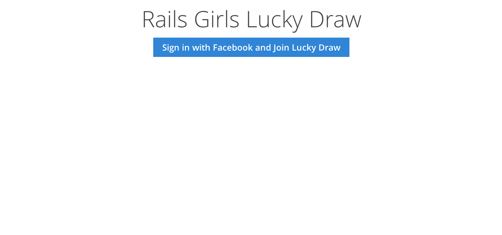
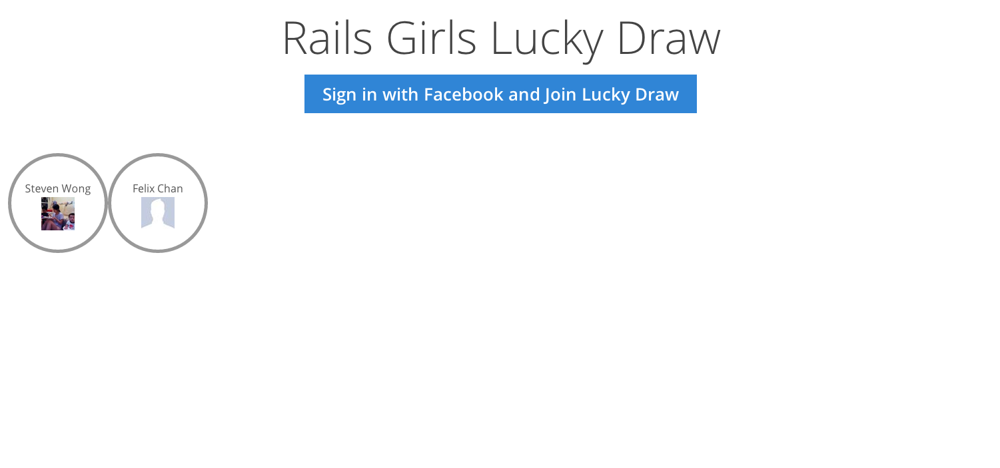
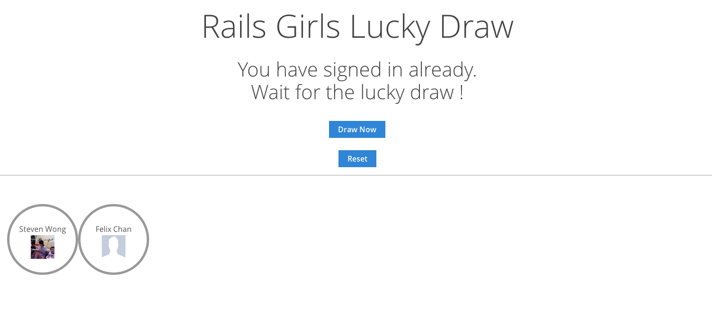
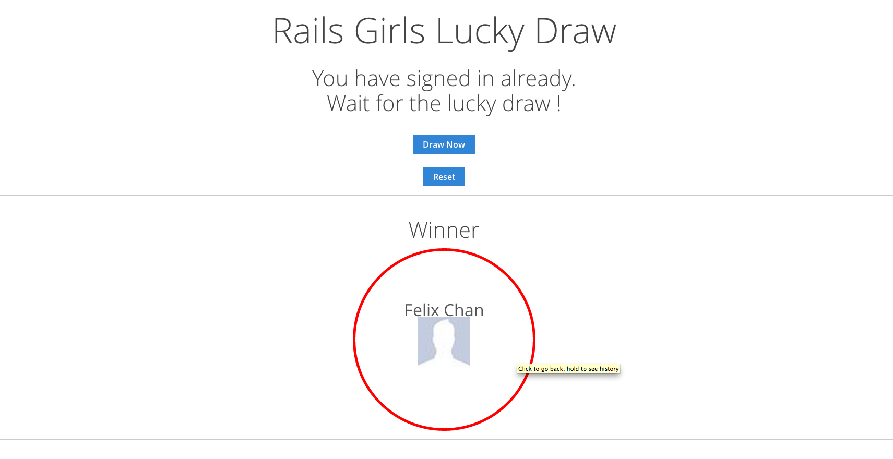

Real Time Lucky Draw Website
============================

1. Attendee register the account using Facebook and will be eligible for lucky draw.

2. All the browsers opened will see the drawing progress and result in real time.

3. Only Admin user can start a lucky draw.

Game Flow
============================

### Step 1: Attendee has to register using facebook

### Step 2: You can see all the attendees in the landing page

### Step 3: Admin can start lucky draw

### Step 4: All the browser will be able to see the washing and result in real time

== Admin

1. You can change your user account to admin account by changing the is_admin value to true.

2. Admin account is not eligible for the lucky draw

3. You have to setup the following five environment variables (or heroku config) to start using this:

    // refer to .env-sample
    FB_APP_ID=
    FB_APP_SECRET=
    PUSHER_APP_ID=
    PUSHER_APP_KEY=
    PUSHER_APP_SECRET=
